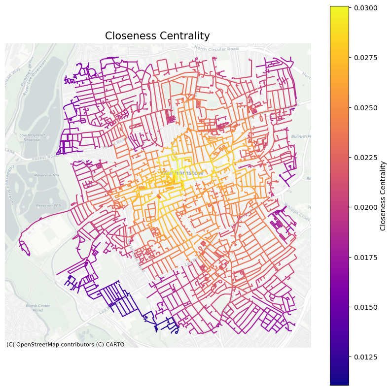
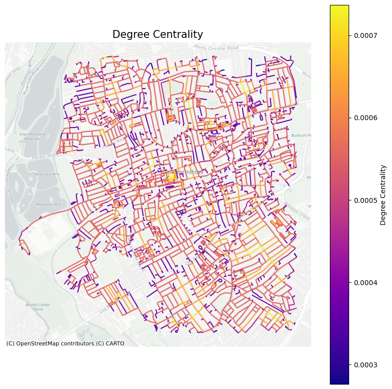
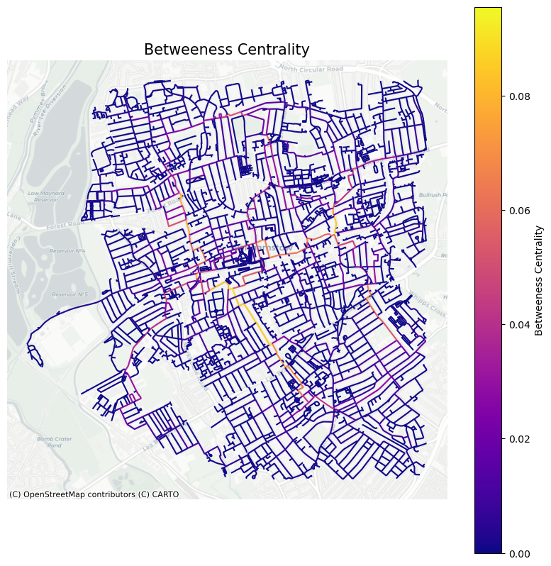

```python
!pip install osmnx
```

    Collecting osmnx
      Downloading osmnx-2.0.1-py3-none-any.whl.metadata (4.9 kB)
    Requirement already satisfied: geopandas>=1.0 in /opt/anaconda3/lib/python3.12/site-packages (from osmnx) (1.0.1)
    Requirement already satisfied: networkx>=2.5 in /opt/anaconda3/lib/python3.12/site-packages (from osmnx) (3.2.1)
    Requirement already satisfied: numpy>=1.22 in /opt/anaconda3/lib/python3.12/site-packages (from osmnx) (1.26.4)
    Requirement already satisfied: pandas>=1.4 in /opt/anaconda3/lib/python3.12/site-packages (from osmnx) (2.2.2)
    Requirement already satisfied: requests>=2.27 in /opt/anaconda3/lib/python3.12/site-packages (from osmnx) (2.32.2)
    Requirement already satisfied: shapely>=2.0 in /opt/anaconda3/lib/python3.12/site-packages (from osmnx) (2.0.6)
    Requirement already satisfied: pyogrio>=0.7.2 in /opt/anaconda3/lib/python3.12/site-packages (from geopandas>=1.0->osmnx) (0.10.0)
    Requirement already satisfied: packaging in /opt/anaconda3/lib/python3.12/site-packages (from geopandas>=1.0->osmnx) (23.2)
    Requirement already satisfied: pyproj>=3.3.0 in /opt/anaconda3/lib/python3.12/site-packages (from geopandas>=1.0->osmnx) (3.7.0)
    Requirement already satisfied: python-dateutil>=2.8.2 in /opt/anaconda3/lib/python3.12/site-packages (from pandas>=1.4->osmnx) (2.9.0.post0)
    Requirement already satisfied: pytz>=2020.1 in /opt/anaconda3/lib/python3.12/site-packages (from pandas>=1.4->osmnx) (2024.1)
    Requirement already satisfied: tzdata>=2022.7 in /opt/anaconda3/lib/python3.12/site-packages (from pandas>=1.4->osmnx) (2023.3)
    Requirement already satisfied: charset-normalizer<4,>=2 in /opt/anaconda3/lib/python3.12/site-packages (from requests>=2.27->osmnx) (2.0.4)
    Requirement already satisfied: idna<4,>=2.5 in /opt/anaconda3/lib/python3.12/site-packages (from requests>=2.27->osmnx) (3.7)
    Requirement already satisfied: urllib3<3,>=1.21.1 in /opt/anaconda3/lib/python3.12/site-packages (from requests>=2.27->osmnx) (2.2.2)
    Requirement already satisfied: certifi>=2017.4.17 in /opt/anaconda3/lib/python3.12/site-packages (from requests>=2.27->osmnx) (2024.8.30)
    Requirement already satisfied: six>=1.5 in /opt/anaconda3/lib/python3.12/site-packages (from python-dateutil>=2.8.2->pandas>=1.4->osmnx) (1.16.0)
    Downloading osmnx-2.0.1-py3-none-any.whl (99 kB)
       ━━━━━━━━━━━━━━━━━━━━━━━━━━━━━━━━━━━━━━━━ 99.6/99.6 kB 2.0 MB/s eta 0:00:00a 0:00:01
    [?25hInstalling collected packages: osmnx
    Successfully installed osmnx-2.0.1


```python
# imports the various library for the lab
import numpy as np
import pandas as pd
import matplotlib
import matplotlib.pyplot as plt
import osmnx as ox # this line imports osmnx
import networkx as nx # this line imports networkx
import matplotlib.cm as cm
import matplotlib.colors as colors
#from IPython.display import IFrame
#ox.config(log_console=True, use_cache=True)

import sys
```


```python
# Select a neighbourhood of London you know well and get the graph in osmnx with a radius of 2000m

G=ox.graph_from_address('Walthamstow, London', dist=2000, network_type='walk')

```


```python
# This converts G (a MultiDiGraph) into a DiGraph (a directed graph without multiple edges between nodes).
DG = ox.convert.to_digraph(G)
```


```python
# Run a street network analysis for a neighbourhood in London: closeness centrality

edge_bc = nx.closeness_centrality(nx.line_graph(DG))
nx.set_edge_attributes(DG, edge_bc,'cc')
```


```python
# Run a street network analysis for a neighbourhood in London: degree centrality

edge_dc = nx.degree_centrality(nx.line_graph(DG))
nx.set_edge_attributes(DG, edge_dc,'dc')

```


```python
# Run a street network analysis for a neighbourhood in London: betweenesss centrality

edge_dc = nx.betweenness_centrality(nx.line_graph(DG))
nx.set_edge_attributes(DG, edge_dc,'bc')
```


```python
#turn it into a multi-graph
G1 = nx.MultiGraph(DG)
```


```python
# convert graph to geopandas dataframe
gdf_edges = ox.graph_to_gdfs(G1,nodes=False,fill_edge_geometry=True)

# set crs to 3857 (needed for contextily)
gdf_edges = gdf_edges.to_crs(epsg=3857) # setting crs to 3857

# plot edges according to closeness centrality
ax=gdf_edges.plot('cc',cmap='plasma',figsize=(10,10),legend=True,
                     legend_kwds={'label': "Closeness Centrality", 'orientation': "vertical"})

# add a basemap using contextilly
import contextily as ctx
ctx.add_basemap(ax,source=ctx.providers.CartoDB.Positron)
plt.axis('off')
plt.title ('Closeness Centrality', fontsize=15)

plt.savefig('cc.png', bbox_inches='tight', dpi=300)

plt.show()
```


    

    


```python
# convert graph to geopandas dataframe
gdf_edges = ox.graph_to_gdfs(G1,nodes=False,fill_edge_geometry=True)

# set crs to 3857 (needed for contextily)
gdf_edges = gdf_edges.to_crs(epsg=3857) # setting crs to 3857

# plot edges according to degree centrality
ax=gdf_edges.plot('dc',cmap='plasma',figsize=(10,10),legend=True,
                     legend_kwds={'label': "Degree Centrality", 'orientation': "vertical"})

# add a basemap using contextilly
import contextily as ctx
ctx.add_basemap(ax,source=ctx.providers.CartoDB.Positron)
plt.title ('Degree Centrality', fontsize=15)
plt.axis('off')

plt.savefig('dc.png', bbox_inches='tight', dpi=300)
plt.show()
```


    

    


```python
# convert graph to geopandas dataframe
gdf_edges = ox.graph_to_gdfs(G1,nodes=False,fill_edge_geometry=True)

# set crs to 3857 (needed for contextily)
gdf_edges = gdf_edges.to_crs(epsg=3857) # setting crs to 3857

# plot edges according to betweeness centrality
ax=gdf_edges.plot('bc',cmap='plasma',figsize=(10,10),legend=True,
                     legend_kwds={'label': "Betweeness Centrality", 'orientation': "vertical"})

# add a basemap using contextilly
import contextily as ctx
ctx.add_basemap(ax,source=ctx.providers.CartoDB.Positron)
plt.title ('Betweeness Centrality', fontsize=15)
plt.axis('off')


plt.savefig('bc.png', bbox_inches='tight', dpi=300)
plt.show()
```


    

    


```python
#Run a street network analysis for a neighbourhood in London: land use
```


```python
fig, ax = plt.subplots(figsize=(10,10))

# Plot buildings with a legend
plot = all_geom[all_geom['building'].notna()].plot('building',
                                                   ax=ax,
                                                   categorical=True,
                                                   legend=True)

# Move legend outside the map
leg = ax.get_legend()
leg.set_bbox_to_anchor((1.4, 0.9))  # Moves legend outside (right side)
leg.set_title("Building Types")  # Optional: Add a title

# Add basemap
ctx.add_basemap(ax, source=ctx.providers.CartoDB.Positron)

plt.axis('off')  # Remove axes

plt.title ('Building Landuse in Walthamstow', fontsize=15)
plt.savefig('landuse.png', bbox_inches='tight', dpi=300)
plt.show()

```


    

    


```python
Research Question: Identifying the most optimal location for a cafe in Walthamstow

Café Nero is opening a cafe in Walthamstow. This project seeks to identify the most optimal location for the cafe to maximise footfall. 
OSMnx was utilised to obtain a graph of Walthamstow with a 2000m radius. This graph was used to explore closeness centrality, degree centrality, betweenness centrality and land use. 

Figure 1 shows that Walthamstow Central has the greatest closeness centrality, indicating that Walthamstow Central is a highly accessible location. 
This is expected as the London Overground and Underground stations are situated in this location. Similarly, Figure 2 shows that Walthamstow Central has a high degree centrality, suggesting that this node is directly connected to many other nodes.
By contrast, Figure 3 reveals that Walthamstow Central does not have a high betweenness centrality. Figure 3 evidences high betweenness centrality on Hoe Street. This suggests that this node acts as an intermediary in the shortest path between other nodes. 

Therefore, it can be suggested that Café Nero ought to locate a coffee shop around Selborne Road as there is a high closeness centrality and a high degree centrality at this node. 
As this node is highly accessible and can be directly reached by many other nodes, it means that people are more likely to visit the cafe as it is conveniently placed.
As well as this, Selborne Road is adjacent to Hoe Street which means it will have high visibility which is likely to yield greater footfall. Figure 4 confirm this argument as retail shops and train stations are located on Selborne Road.


```
